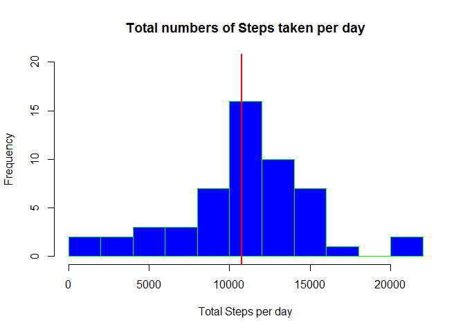
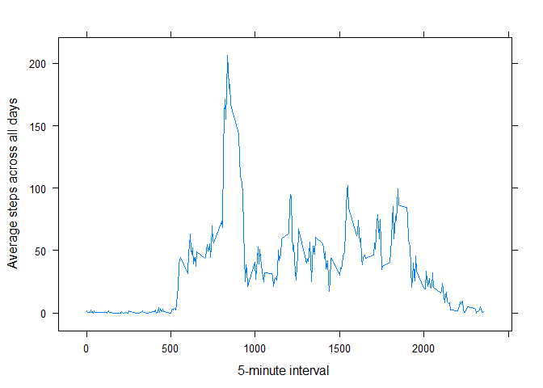
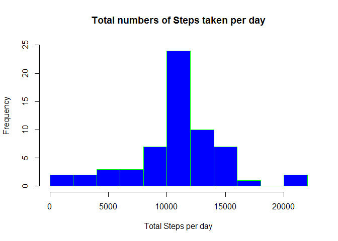
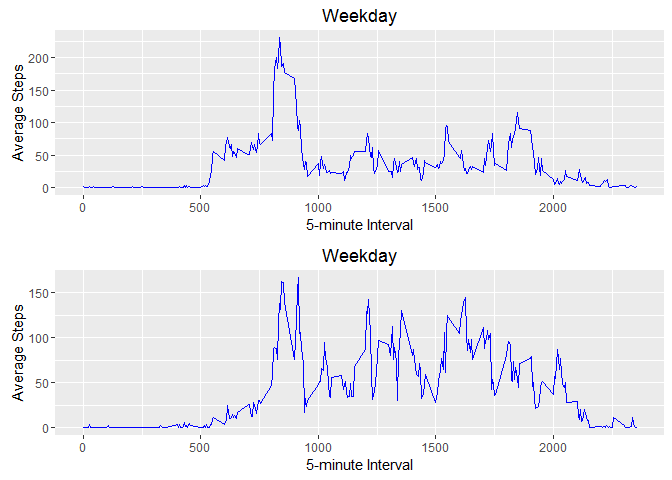

# Reproducible Research: Peer Assessment 1


## Loading and preprocessing the data

```r
# It assumes activity.csv is in same working directory
input <- read.csv("activity.csv")
```

## What is mean total number of steps taken per day?

```r
# Sum steps for given date. Aggregage ignores missing value by default
resultsum <- aggregate(steps ~ date, data = input, sum)
#Calculate mean of the total number of steps taken per day
meanresult <- mean(resultsum$steps)
meanresult
```

```
## [1] 10766.19
```

```r
#Calculate median of the total number of steps taken per day
medianresult <- median(resultsum$steps)
medianresult
```

```
## [1] 10765
```

```r
#Draw Histogram
hist(resultsum$steps,main="Total numbers of Steps taken per day", xlab="Total Steps per day",border="green",col="blue",breaks=10,ylim=c(0,20))
# Draw mean as violet line
abline(v = meanresult, col = "violet", lwd = 2)
# Draw median as redline
abline(v = medianresult, col = "red", lwd = 2)
```




## What is the average daily activity pattern?

```r
# average number of steps taken, averaged across all days.  
# Please note that Aggregage ignores missing value by default.
meanperday <- aggregate(steps ~ interval, data = input, mean)
#load lattice library for plot
library(lattice)
#time series plot (i.e. type = "l") of the 5-minute interval (x-axis) and the average number of steps taken, averaged across all days (y-axis)
xyplot(steps~interval,data=meanperday,type="l",xlab="5-minute interval ",ylab="Average steps across all days")
```



```r
#Which 5-minute interval, on average across all the days in the dataset, contains the maximum number of steps?
maxsteps <- meanperday[meanperday$steps == max(meanperday$steps),]
#print interval with maximum steps
maxsteps$interval
```

```
## [1] 835
```

## Inputing missing values

```r
#New dataset that is equal to the original dataset but with the missing data will be filled in
input_missing <- input

#total number of missing values in the dataset
sum(is.na(input$steps))
```

```
## [1] 2304
```

```r
#Strategy for filling in all of the missing values in the dataset.
#Fill all NA with mean for that 5-minute interval
meanperday_to_fill_missing <- aggregate(steps ~ interval, data = input, mean)
for(i in 1:nrow(input_missing))
{
        if(is.na(input_missing[i,]$steps))
        {
                 input_missing[i,]$steps <- meanperday_to_fill_missing[meanperday_to_fill_missing$interval == input_missing[i,]$interval,]$steps
         }
}
#Make a histogram of the total number of steps taken each day 
resultsum_missing <- aggregate(steps ~ date, data = input_missing, sum)
hist(resultsum_missing$steps,main="Total numbers of Steps taken per day", xlab="Total Steps per day",border="green",col="blue",breaks=10,ylim=c(0,25))
```



```r
#Calculate mean of the total number of steps taken per day
meanresult_missing <- mean(resultsum_missing$steps)

#Calculate median of the total number of steps taken per day
medianresult_missing <- median(resultsum_missing$steps)

#Do these values differ from the estimates from the first part of the assignment? 
#Original Mean
meanresult
```

```
## [1] 10766.19
```

```r
# New Mean after filling missing value
meanresult_missing
```

```
## [1] 10766.19
```

```r
# Original Median
medianresult
```

```
## [1] 10765
```

```r
# New Median after filling missing value
medianresult_missing
```

```
## [1] 10766.19
```


## Are there differences in activity patterns between weekdays and weekends?

```r
##define weekend list
weekendlist <- c("Saturday","Sunday")

##Create a new factor variable in the dataset with two levels - "weekday" and "weekend" indicating whether a given date is a weekday or weekend day.
input_missing$weekday <- factor(weekdays(as.Date(input_missing$date)) %in% weekendlist,levels=c(TRUE, FALSE),labels=c('weekend','weekday'))

##Split data in weekday and weekend
weekdaydata <- input_missing[input_missing$weekday == 'weekday',]
weekenddata <- input_missing[input_missing$weekday == 'weekend',]

## Average number of steps taken, averaged across all weekday 
meanweekday <- aggregate(steps ~ interval, data = weekdaydata, mean)
##average number of steps taken, averaged across all weekend days 
meanweekend <- aggregate(steps ~ interval, data = weekenddata, mean)

#Merge Weekday and Weekend data
mergetotal <- merge(meanweekday,meanweekend, by.x = "interval", by.y = "interval")
colnames(mergetotal) <- c("interval","Mean_WeekDay_Steps","Mean_WeekEnd_Steps")

##Panel plot containing a time series plot (i.e. type = "l") of the 5-minute interval (x-axis) and the average number of steps taken, averaged across all weekday days or weekend days (y-axis). 
library(ggplot2)
```

```
## Warning: package 'ggplot2' was built under R version 3.2.4
```

```r
weekdayplot <- ggplot(mergetotal,aes(interval,Mean_WeekDay_Steps)) + geom_line() + xlab("5-minute Interval") + ylab("Average Steps") + ggtitle("Weekday") + geom_line(colour="blue")
weekendplot <- ggplot(mergetotal,aes(interval,Mean_WeekDay_Steps)) + geom_line() + xlab("5-minute Interval") + ylab("Average Steps") + ggtitle("Weekday") + geom_line(colour="blue")
library(grid)
pushViewport(viewport(layout = grid.layout(2, 1)))
 weekendplot <- ggplot(mergetotal,aes(interval,Mean_WeekEnd_Steps)) + geom_line() + xlab("5-minute Interval") + ylab("Average Steps") + ggtitle("Weekday") + geom_line(colour="blue")
print(weekdayplot, vp = viewport(layout.pos.row = 1, layout.pos.col = 1))
print(weekendplot, vp = viewport(layout.pos.row = 2, layout.pos.col = 1))
```




